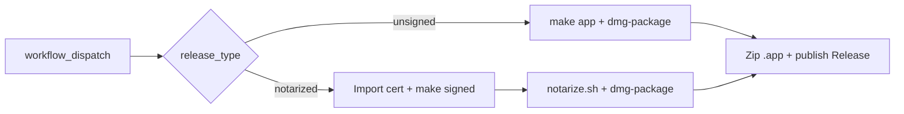

# GitHub Actions workflows

CI/CD for GrokBuild on `macos-latest`. See [BUILDING.md](../../BUILDING.md#github-releases) for release prep, secrets setup, and the local `make release` alternative.

| Workflow | File | When it runs |
|----------|------|--------------|
| **PR Checks** | [`pr.yml`](pr.yml) | Pull requests to `main`; manual dispatch |
| **Release** | [`release.yml`](release.yml) | Manual dispatch only (tag push trigger is disabled) |

---

## PR Checks (`pr.yml`)

Validates that the project builds and tests pass on macOS before merge.

### Triggers

- **`pull_request`** → branch `main`
- **`workflow_dispatch`** — run manually from **Actions → PR Checks → Run workflow**

### Concurrency

One run per ref (`pr-checks-${{ github.ref }}`). A newer push cancels an in-progress run for the same PR.

### Job: `test-and-build`

| Step | What it does |
|------|----------------|
| Checkout | `actions/checkout@v4` |
| Show Swift version | `swift --version` |
| Run tests | `make test` |
| Setup Node.js 22 | For bundling Computer Use |
| Install agent-desktop | `npm install -g agent-desktop` |
| Build unsigned app | `make app` |
| Verify bundle | Asserts `dist/GrokBuild.app` exists and `Contents/MacOS/agent-desktop` is executable |

### What it does **not** do

- No codesigning or notarization
- No DMG packaging
- No GitHub release publish

### Local equivalent

```bash
make test
npm install -g agent-desktop   # if testing full bundle like CI
make app
```

---

## Release (`release.yml`)

Builds distributable assets and publishes a **GitHub Release** for tag `v{VERSION}`.

### Triggers

**Manual dispatch only** — **Actions → Release → Run workflow**.

Tag push auto-release is commented out in the workflow file:

```yaml
# push:
#   tags:
#     - 'v*'
```

### Inputs

| Input | Default | Description |
|-------|---------|-------------|
| `release_type` | `notarized` | `notarized` or `unsigned` |
| `version` | *(empty)* | Optional tag override; must match `VERSION` (e.g. `v0.1.11`). Empty uses `v$(cat VERSION)`. |

### Preconditions

1. **`VERSION`** matches the release you intend to ship.
2. Changes are committed and pushed to the branch you release from.

The workflow **fails** if the release tag does not match `VERSION`.

### Job: `build`

Runs on `macos-latest` with `contents: write` (to create the release).



#### Shared steps

- Validate tag against `VERSION`
- Install Node.js 22 and `agent-desktop` (bundled into the app)
- Create versioned assets:
  - `dist/GrokBuild-{tag}.app.zip`
  - `dist/GrokBuild-{tag}-macOS.dmg`
- Publish via `softprops/action-gh-release@v2` with generated changelog + custom body

#### Unsigned path (`release_type: unsigned`)

```bash
make app
make dmg-package
```

No Apple signing secrets required. Release title: **`v{VERSION} (Unsigned)`**. Notes include Gatekeeper bypass instructions.

#### Notarized path (`release_type: notarized`, default)

1. Import Developer ID certificate from secrets (`apple-actions/import-codesign-certs@v3`)
2. `make signed SIGN_IDENTITY=...`
3. `./scripts/notarize.sh dist/GrokBuild.app` (Apple API key from secrets)
4. `make dmg-package`

Release title: **`v{VERSION} (Notarized)`**. **Required for in-app GrokBuild updates** — the updater only offers notarized releases.

### Required secrets (notarized only)

| Secret | Purpose |
|--------|---------|
| `MACOS_CERTIFICATE` | Base64-encoded `.p12` Developer ID certificate |
| `MACOS_CERTIFICATE_PWD` | Password for the `.p12` |
| `SIGN_IDENTITY` | Codesign identity (optional; defaults to `Developer ID Application`) |
| `APPLE_API_KEY_ID` | App Store Connect API key ID |
| `APPLE_API_ISSUER_ID` | App Store Connect issuer ID |
| `APPLE_API_KEY_BASE64` | Base64-encoded `.p8` API key |

`GITHUB_TOKEN` is provided automatically for release creation.

**Note:** CI uses Apple API keys for notarization. Local builds can use a keychain profile (`NOTARY_PROFILE`) via `make notarize`; see [`scripts/notarize.sh`](../../scripts/notarize.sh).

### Release outputs

| Asset | In-app updater |
|-------|----------------|
| `GrokBuild-{tag}.app.zip` | Yes — downloaded by **Update App** when release is notarized |
| `GrokBuild-{tag}-macOS.dmg` | Manual install only |

### Local equivalent

```bash
make release                                              # unsigned
make release RELEASE_TYPE=notarized SIGN_IDENTITY="..." NOTARY_PROFILE=...
```

See [`scripts/release.sh`](../../scripts/release.sh) and [scripts/README.md](../../scripts/README.md).

---

## Choosing a workflow

| Goal | Use |
|------|-----|
| Verify a PR before merge | **PR Checks** (automatic on PRs to `main`) |
| Ship a version to GitHub | **Release** (manual dispatch) |
| Quick local validation | `make test && make app` |
| Ship from your machine | `make release` instead of CI |

Use **one release path per version** — do not run CI Release and local `make release` for the same tag.
