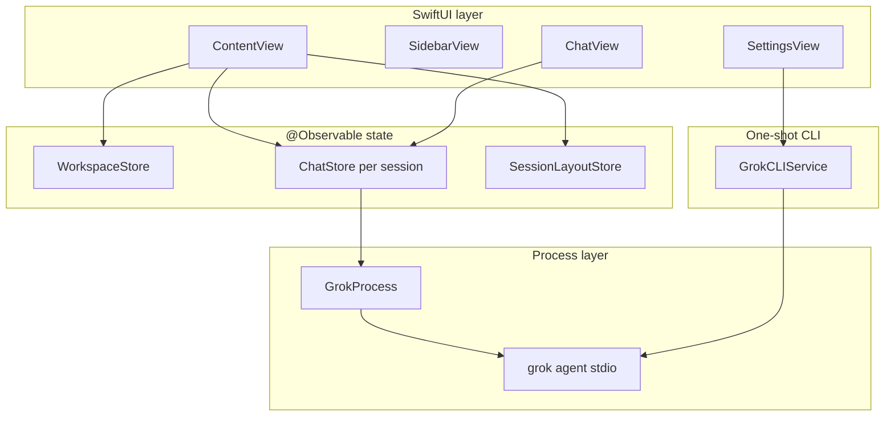
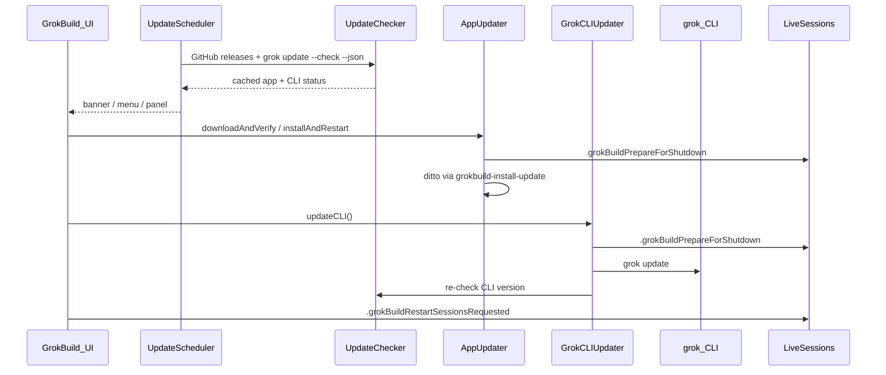

# GrokBuild — architecture reference

**Read this first in every new chat.** This document is the canonical map of how GrokBuild works. `AGENTS.md` points here; `.cursor/rules/` add file-specific conventions.

---

## Table of contents

1. [What GrokBuild is](#what-grokbuild-is)
2. [Design rules for agents](#design-rules-for-agents)
3. [Repository layout](#repository-layout)
4. [App lifecycle & shell](#app-lifecycle--shell)
5. [Runtime architecture](#runtime-architecture)
6. [GrokProcess & ACP](#grokprocess--acp)
7. [ChatStore](#chatstore)
8. [Multi-session model](#multi-session-model-contentview)
9. [Workspaces & projects](#workspaces--projects)
10. [Persistence](#persistence-userdefaults)
11. [Feature subsystems](#feature-subsystems)
12. [Settings system](#settings-system)
13. [In-app updates](#in-app-updates)
14. [UI layout & panels](#ui-layout--panels)
15. [Notifications](#notifications)
16. [Git integration](#git-integration)
17. [Build, test & release](#build-test--release)
18. [Common tasks → files](#common-tasks--files)
19. [Tests](#tests)
20. [Anti-patterns](#anti-patterns)
21. [Related docs](#related-docs)

---

## What GrokBuild is

GrokBuild is a **menu-bar macOS app** (SwiftUI + AppKit) that is a **UI shell over the `grok` CLI**. It spawns `grok agent stdio` per chat session and speaks **ACP (Agent Client Protocol)** JSON-RPC over stdin/stdout.

| GrokBuild owns | `grok` CLI owns (do NOT reimplement in Swift) |
|----------------|-----------------------------------------------|
| Windows, sidebar, composer, settings panes | ACP session lifecycle, tool execution |
| Multi-tab sessions, LRU process cap | MCP server wiring at runtime (GrokBuild only *injects* configs) |
| Per-project model/effort, layout persistence | Skills, hooks, plugins, plan mode, subagents |
| Browser/Computer Use **enablement** + bundled skills | Agent reasoning, permissions policy enforcement |
| In-app updates (app + CLI) | `grok update`, auth (`grok login`) |

**Platform:** macOS 26+. **Version:** `VERSION` → `AppVersion.display`. **Build:** SwiftPM only — no Xcode project; use `make` / `swift build`.

---

## Design rules for agents

1. **Stay thin** — UI and local state only; wrap the CLI, don't replace it.
2. **Reuse services** — extend `GrokProcess`, `GrokCLIService`, `ChatStore`, `WorkspaceStore`, `SessionLayoutStore`, and feature services below.
3. **Match conventions** — read surrounding code before editing; minimize diff scope.
4. **Draft vs applied settings** — settings panes edit *draft* keys; live Grok sessions use *applied* keys (see [Settings system](#settings-system)).
5. **Post notifications** — auth/process changes → `.grokStatusChanged`; session title changes → `.liveSessionMessagesChanged`.
6. **Docs + tests with every code change** — run `make test`, add/extend `Tests/GrokBuildTests/`, update this file and other relevant docs in the same session (`.cursor/rules/docs-and-tests.mdc`).
7. **Commit only when asked** — user rule in this repo.

---

## Repository layout

```
grok-deck2/
├── GrokBuild/                    # Main app target (SwiftUI + AppKit)
│   ├── main.swift                # NSApplication entry (NOT GrokBuildApp.swift)
│   ├── AppDelegate.swift         # Single instance, main window, menus
│   ├── StatusBarController.swift # Menu bar icon + actions
│   ├── ContentView.swift         # Root view: multi-session orchestration
│   ├── Views/                    # SwiftUI screens (SettingsView is large)
│   ├── Services/                 # Business logic, CLI integration
│   ├── Models/                   # Workspace, Message, Composer types
│   ├── Resources/
│   │   ├── Assets.xcassets/      # Menu bar icon, app icon
│   │   └── Skills/               # Bundled grok skills (copied at build)
│   ├── AboutPanel.swift          # AppKit About panel
│   └── UpdatePanel.swift         # AppKit Updates panel
├── GrokBuildComputerUseMCP/      # Separate SPM target: stdio MCP bridge → agent-desktop
├── Tests/GrokBuildTests/         # Unit/integration tests
├── scripts/                      # build-macos-app.sh, release.sh, notarize.sh, install-update
├── Package.swift                 # SPM manifest (macOS 26+)
├── VERSION                       # App version source
├── Makefile                      # make run | test | app | release
├── AGENTS.md                     # Agent entry (points here)
└── BUILDING.md                   # Signing, notarization, CI
```

**Excluded from build:** `GrokBuild/GrokBuildApp.swift` (legacy `@main` — do not use).

---

## App lifecycle & shell

### Entry point

`main.swift` → `AppDelegate.applicationDidFinishLaunching`:

1. **Single instance** — advisory `flock` on `~/Library/Application Support/GrokBuild/instance.pid`. Second launch posts `com.grokbuild.showMainWindow` and exits.
2. **Activation policy** — `.regular` (Dock icon + menu bar item).
3. **Status bar** — `StatusBarController()` (menu: About, updates, sessions, quit).
4. **Update scheduler** — `UpdateScheduler.start()` (background checks).
5. **Main window** — `openMainWindow()` hosts `ContentView` in `NSHostingController`.

### Window behavior

- **Close button** hides the window (`orderOut`), does not quit (`applicationShouldTerminateAfterLastWindowClosed` → false).
- **Reopen** (Dock click) → `applicationShouldHandleReopen` → show main window.
- Frame autosave name: `"MainWindow"`.

### Dual menus

| Menu | Location | Purpose |
|------|----------|---------|
| **App menu bar** (top of screen) | `AppDelegate.setupMainMenu()` | Edit, Project, Session shortcuts |
| **Status item menu** | `StatusBarController` | Quick actions, updates, quit |

Menu actions that need the main UI post notifications (e.g. `.newSessionRequested`) that `ContentView` handles.

---

## Runtime architecture



### Request path (send a message)

1. User types in `ChatView` → `ChatStore.send(_:)`.
2. `ChatStore` ensures workspace selected and `GrokProcess` is `.ready` (restarts if needed).
3. Appends user `Message`, creates empty assistant `Message`, sets `isStreaming`.
4. `GrokProcess.send(prompt)` → ACP `session/prompt` JSON-RPC on stdin.
5. `GrokProcess` reader parses stdout → `AcpEvent` stream.
6. `ChatStore.consumeOutput()` maps events → message text, tool cards, permissions, thinking blocks.
7. On completion → `isStreaming = false`, posts `.liveSessionMessagesChanged`, `.grokStatusChanged`.

### CLI discovery (shared)

`GrokProcess.locateGrokCLI()` and `GrokCLIService.locateGrokCLI()` search in order:

1. `GROK_CLI_PATH` environment variable
2. `~/.grok/bin/grok`
3. Homebrew paths
4. `PATH`

User must run `grok login` for authenticated sessions. Auth failures surface in `ChatStore.authRequiredMessage` and menu bar indicator.

---

## GrokProcess & ACP

**File:** `Services/GrokProcess.swift`

`GrokProcess` is the long-running **ACP client**. One instance per `ChatStore`.

### Process states (`GrokProcessState`)

| State | Meaning |
|-------|---------|
| `.idle` | No process |
| `.starting` | Launching CLI, ACP handshake in progress |
| `.ready` | Session created/loaded, can accept prompts |
| `.busy` | Turn in progress |
| `.failed(String)` | Startup or fatal error; check `needsAuthentication` |

### Launch command shape

```
grok [--no-memory] [--permission-mode X] [--sandbox X] [--allow RULE] … \
     agent [--reasoning-effort X] [--model M] stdio
```

Built from `GrokLaunchOptions` in `ChatStore.restartProcess`. Working directory = **workspace path**.

### ACP lifecycle

1. `start(workspace:options:)` — spawn process, `initializeACP()` (JSON-RPC handshake).
2. `createSession(workspace:mcpServers:)` **or** `loadSession(id:…)` if resuming.
3. MCP servers from `MCPServerConfig` passed in `session/new` (browser, computer use when enabled).
4. `send(_:)` — prompt during `.ready`/`.busy`.
5. `stop()` — tear down process (LRU cap, settings reload, app shutdown).

### ACP events (`AcpEvent`)

Consumed by `ChatStore.consumeOutput()`:

| Event | UI effect |
|-------|-----------|
| `.messageChunk` | Append to streaming assistant message |
| `.thoughtChunk` | Thinking panel text |
| `.toolCall` / `.toolCallUpdate` | Live tool call cards |
| `.permissionRequest` | Permission dialog in chat |
| `.exitPlanRequest` | Plan mode approval UI |
| `.questionRequest` | Ask-user question UI |
| `.modeChanged` | Agent / Plan / Yolo selector |
| `.contextUsage` | Token usage indicator |
| `.availableCommands` | Slash command autocomplete |
| `.error` | Error banner |

### Agent modes

`AgentMode`: `.agent`, `.plan`, `.yolo` — synced from process to `ChatStore.currentMode`.

### Model switching

`session/set_model` RPC. Failures set `modelSwitchError` / `modelSwitchNeedsNewSession` on both `GrokProcess` and `ChatStore`.

---

## ChatStore

**File:** `Services/ChatStore.swift` — `@Observable @MainActor`

One `ChatStore` per live session tab. Owns a `GrokProcess`.

### Key published state

| Property | Purpose |
|----------|---------|
| `messages` | Chat history (`Message` model) |
| `connectionState` | Mirrors `GrokProcess.state` |
| `isStreaming` / `isGrokking` | Turn in progress |
| `currentModel` / `availableModels` | Model picker (from ACP + custom models) |
| `currentMode` | agent / plan / yolo |
| `pendingPermissions` | Tool permission prompts |
| `pendingExitPlan` / `pendingQuestions` | Plan / ask-user flows |
| `fileAttachments` | Composer chips; hidden chips are excluded from the prompt |
| `authRequiredMessage` | Login banner text |
| `grokSessionId` | `process.sessionId` — persisted for resume |

### Lifecycle methods

| Method | When |
|--------|------|
| `prepare(workspace:)` | Lazy restore — set workspace, no process spawn |
| `start(workspace:resumeSession:)` | Full start + optional resume |
| `restartProcess(resumeSessionID:)` | Build `GrokLaunchOptions`, spawn process, inject MCP |
| `reloadConfiguration()` | Settings changed — restart with new MCP/env |
| `startNewSession()` | Fresh grok session (same project) |
| `resumeSession(_:)` | Load existing grok session id |
| `shutdown()` | Stop process (app update / prepare for shutdown) |
| `retryConnection()` | Restart after CLI update |
| `send(_:)` | User message → ACP prompt (attachments become plain paths under `Attached file(s):`, not `@` reads) |

### `restartProcess` — what gets injected

On every (re)start, `ChatStore`:

1. Loads **permission settings** from `GrokSettingsKeys` (UserDefaults).
2. Loads **applied** browser + computer use settings.
3. Installs bundled **skills** to `~/.grok/skills/` if features enabled.
4. Starts external browser if browser tools enabled (CDP mode).
5. Builds MCP list:
   - `AgentBrowserService.browserMCPConfig(settings:)` → `grokbuild-browser`
   - `ComputerUseService.computerUseMCPConfig(settings:)` → `grokbuild-computer-use`
6. Passes model from **per-project** `SessionLayoutStore.agentSettings` (fallback: saved session selection).

### Per-project agent settings

Model + reasoning effort are **per workspace**, not global:

- Stored in `SessionLayoutStore` → `WorkspaceLayoutSnapshot.agentSettingsByWorkspace`
- Loaded via `loadWorkspaceAgentSettings()` on prepare/start/switch
- Changing model in chat writes back to `SessionLayoutStore`
- Sibling sessions in same project sync via `.workspaceAgentSettingsChanged`

### Session selection persistence

`grokbuild.sessionSelections.v1` — per **grok session id**: saved mode (model is project-level now).

---

## Multi-session model (`ContentView`)

**File:** `ContentView.swift` — root orchestrator.

### Core types

```swift
ContentView.LiveSession {
    id: UUID              // Stable tab id (persisted)
    store: ChatStore      // One GrokProcess inside
    workspace: Workspace
    title: String         // Sidebar label
    grokSessionID: String? // For lazy resume after LRU teardown
}
```

### LRU connection cap

| Constant | Value | Behavior |
|----------|-------|----------|
| `maxConnectedSessions` | 4 | Max live `grok agent stdio` processes |
| `recentSessionOrder` | MRU list | Drives eviction |

**Lazy restore at launch:** `restorePersistedSessions()` rebuilds `LiveSession` shells (titles, grok ids) but only **starts the selected session's process**. Others resume on first `selectSession` via `ensureSessionStarted`.

**Eviction:** `enforceConnectionCap()` stops processes for sessions beyond MRU cap (keeps selected + busy sessions).

### Session persistence flow

```
selectSession / send / close
    → persistSessionLayout()
    → SessionLayoutStore.saveSessions(SessionLayoutSnapshot)
```

`SavedSessionRecord`: `id`, `workspaceID`, `grokSessionID`, `title`, `lastAccessed`.

Sidebar shows max `SessionLayoutStore.maxSidebarSessions` (10) per project; older sessions in **Browse Sessions**.

### Active store routing

| Selection | Chat UI binds to |
|-----------|------------------|
| Session selected | `activeStore` = that session's `ChatStore` |
| No session | `placeholderStore` (empty state) |

### Bootstrap sequence

```
.onAppear → bootstrap() → restorePersistedSessions()
    → rebuild LiveSession array from disk
    → selectSession(saved selection)
    → ensureSessionStarted (spawn process if grokSessionID set)
```

---

## Workspaces & projects

**File:** `Services/WorkspaceStore.swift`, `Models/Workspace.swift`

A **workspace** = one folder on disk (`Workspace.path`). Multiple sessions can belong to one workspace.

| Operation | Method |
|-----------|--------|
| Add project | `WorkspaceStore.add` — dedupes by resolved path |
| Remove | `WorkspaceStore.remove` — also clears agent settings |
| Pin / reorder | `pin` / `unpin` / `moveWorkspaces` → `SessionLayoutStore` workspace layout |
| Pick folder | `WorkspacePicker` sheet |

Display name: `workspace.displayName` (custom `name` or folder basename).

---

## Persistence (UserDefaults)

**Domain:** `~/Library/Preferences/com.grokbuild.app.plist` (standard UserDefaults).

Do **not** commit exported plist files from repo root (`.gitignore`).

### Keys reference

| Key | Store | Contents |
|-----|-------|----------|
| `GrokBuild.projects.v1` | `WorkspaceStore` | `[Workspace]` JSON |
| `GrokBuild.sessionLayout.v2` | `SessionLayoutStore` | Session records, order, selection, expanded/hidden |
| `GrokBuild.workspaceLayout.v1` | `SessionLayoutStore` | Pin order, workspace order, **`agentSettingsByWorkspace`** |
| `grokbuild.sessionSelections.v1` | `ChatStore` | Per grok session id: mode |
| `grokbuild.permissionMode` | `GrokSettingsKeys` | CLI permission mode |
| `grokbuild.sandboxProfile` | | Sandbox profile string |
| `grokbuild.reasoningEffort` | | Default reasoning effort (settings UI) |
| `grokbuild.noMemory` | | `--no-memory` flag |
| `grokbuild.disableWebSearch` | | `--disable-web-search` |
| `grokbuild.noSubagents` | | `--no-subagents` |
| `grokbuild.allowRules` / `denyRules` | | Newline-separated `--allow` / `--deny` rules |
| `grokbuild.browser.*` | `BrowserSettingsStore` | Draft browser settings |
| `grokbuild.browser.applied.*` | | **Applied** settings used at process start |
| `grokbuild.computerUse.*` | `ComputerUseSettingsStore` | Draft computer use settings |
| `grokbuild.computerUse.applied.*` | | **Applied** settings used at process start |
| `grokbuild.customModels.v1` | `CustomModelStore` | Provider definitions (UserDefaults) |
| `grokbuild.updates.autoCheckEnabled` | `UpdateSettingsStore` | Background update checks |
| `grokbuild.updates.dismissedVersion` | | Skipped GrokBuild version |
| `grokbuild.updates.dismissedCLIVersion` | | Skipped grok CLI version |
| `grokbuild.updates.lastCheckDate` | | Last check timestamp |

### External files (not UserDefaults)

| Path | Purpose |
|------|---------|
| `~/.grok/config.toml` | Custom model providers (`CustomModelStore` writes here) |
| `~/.grok/skills/` | Installed skills (bundled skills copied by installers) |
| `~/.grokbuild/computer-use/` | Cursor MCP helper binaries |
| `~/Library/Application Support/GrokBuild/Updates/` | Downloaded app update zips |
| `~/Library/Application Support/GrokBuild/instance.pid` | Single-instance lock |

---

## Feature subsystems

### Browser control

| Piece | Location |
|-------|----------|
| Settings | `SettingsView` → `.browser` tab; keys in `BrowserSettings.swift` |
| Service | `AgentBrowserService.swift` — agent-browser CLI, CDP, external browser launch |
| MCP | Name: `grokbuild-browser`; config from `browserMCPConfig` |
| Skill | `Resources/Skills/grokbuild-browser-control/` + `grokbuild-grok-web/` → `BrowserSkillInstaller` (installs both when browser tools enabled) |
| Presets | `BrowserPreset` (e.g. `.grokCom`) — one-click runtime/profile setup in `BrowserSettings.swift`, applied from the Browser pane |
| Chat UI | Status pill in `ChatView`; toggle from composer chrome |

**Runtime modes:** managed Chromium vs external browser (Safari/Chrome/Arc) via CDP URL.

**Tools (via MCP):** `browser_open_url`, `browser_snapshot`, `browser_click_ref`, etc.

**grok.com web:** drive grok.com via browser tools to reach web-only features (Imagine, skills, connectors), then continue locally with Computer Use — see `grokbuild-grok-web` skill.

### Computer Use

| Piece | Location |
|-------|----------|
| Settings | `SettingsView` → `.computerUse` tab; keys in `ComputerUseSettings.swift` |
| Service | `ComputerUseService.swift` — agent-desktop discovery, permissions probe |
| MCP helper | **`GrokBuildComputerUseMCP/`** separate SPM executable (stdio MCP → `agent-desktop`) |
| MCP name | `grokbuild-computer-use` |
| Skill | `Resources/Skills/grokbuild-computer-use/` |
| Cursor bridge | `ComputerUseCursorInstaller` — copies helper, merges `~/.cursor/mcp.json` |

**Tools:** `computer_snapshot`, `computer_click`, `computer_type`, `computer_screenshot`, etc.

**Permissions:** macOS Accessibility; merged status from GrokBuild, helper, agent-desktop, CLI.

### Custom models

| Piece | Location |
|-------|----------|
| Settings | `SettingsView` → `.models`; `CustomModelStore`, `CustomModelSettings` |
| Persistence | Providers in UserDefaults; model entries written to **`~/.grok/config.toml`** |
| Chat | Merged into `ChatStore.availableModels` via `mergeCustomModels()` |

OpenAI-compatible provider URLs; not a replacement for grok-native models.

### Bundled desktop skill

`Resources/Skills/grokbuild-desktop/` — hints for agents working on GrokBuild itself (copied at build, not auto-installed).

### MCP config shape

`MCPServerConfig` → JSON for ACP `session/new`. Supports stdio (command + args + env) and http/sse transports.

---

## Settings system

**File:** `Views/SettingsView.swift` (large — search `SettingsTab`, pane struct names).

### Tabs (`SettingsTab`)

| Tab | Pane | Data source |
|-----|------|-------------|
| `.hooks` | Hooks list | `GrokCLIService.listHooks` |
| `.plugins` | Installed plugins | `listPlugins` |
| `.marketplace` | Marketplace sources | `listMarketplaceSources` |
| `.skills` | Discovered skills | `listSkills` |
| `.mcpServers` | External MCP + health | `listMCPServers` |
| `.browser` | Browser tools | `BrowserSettingsStore` draft keys |
| `.computerUse` | Desktop automation | `ComputerUseSettingsStore` draft keys |
| `.models` | Custom providers | `CustomModelStore` |
| `.permissions` | Session safety toggles | `GrokSettingsKeys` |
| `.app` | App + CLI updates | `UpdateScheduler`, `UpdateSettingsStore` |

### Draft vs applied pattern

| Feature | Draft keys | Applied keys | When applied |
|---------|------------|--------------|--------------|
| Browser | `grokbuild.browser.*` | `grokbuild.browser.applied.*` | **Enable toggle** applies immediately; other fields via **Apply and Restart** |
| Computer Use | `grokbuild.computerUse.*` | `grokbuild.computerUse.applied.*` | Same pattern |

**Live Grok sessions read applied settings only** in `ChatStore.restartProcess` → `BrowserSettingsStore.loadApplied()` / `ComputerUseSettingsStore.loadApplied()`.

Changing settings that affect MCP → call `ChatStore.reloadConfiguration()` (restarts process).

Permissions tab (`GrokSettingsKeys`) apply on next `restartProcess` (no separate applied copy).

---

## In-app updates

Two parallel updaters — **GrokBuild app** (GitHub) and **grok CLI** (`grok update`). Same UI surfaces: menu bar, main-window banner, `UpdatePanel`.

| Service | Role |
|---------|------|
| `UpdateChecker.swift` | Detect: notarized GitHub releases; `grok update --check --json` |
| `UpdateScheduler.swift` | Background checks; cache; `hasActionableAppUpdate` / `hasActionableCLIUpdate` |
| `UpdateSettingsStore.swift` | Auto-check, skip/dismiss per version |
| `AppUpdater.swift` | Download, verify, install, relaunch |
| `GrokCLIUpdater.swift` | Run `grok update`, phases, re-check |
| `UpdateUI.swift` | Present panel; `restartLiveSessions()` |
| `UpdatePanel.swift` | AppKit UI for both updaters |
| `UpdateDebugSimulator.swift` | **DEBUG only** — simulate updates (compiled out of release) |



### App updates

| Step | Detail |
|------|--------|
| Detect | `checkAppRelease()` — newest **notarized** release from GitHub list |
| Notarized filter | Title `(Notarized)` or notes contain `properly code-signed and notarized`; unsigned ignored |
| Download | `GrokBuild-{tag}.app.zip` → `~/Library/Application Support/GrokBuild/Updates/` |
| Verify | `codesign` + `spctl`; Team ID must match installed app |
| Install | `scripts/grokbuild-install-update.sh` (bundled) — wait PID, `ditto`, `open` |
| Skip | `grokbuild.updates.dismissedVersion` |

### CLI updates

| Step | Detail |
|------|--------|
| Detect | `grok update --check --json` |
| Install | `grok update` via `GrokCLIService.updateGrokCLI()` |
| Safety | `.grokBuildPrepareForShutdown` before binary swap |
| Restart | **Restart Sessions** → `retryConnection()` on each live session |
| Skip | `grokbuild.updates.dismissedCLIVersion` |

### UI surfaces

- **Menu:** **Upgrade Available…** / **Check for Updates…** — refresh checks; if updates exist, show the main-window banner only; if up to date, open the panel with status
- **Banner:** `UpdatesBanner` in `ContentView` — **Updates Available** opens `UpdatePanel`
- **Panel:** dual sections; mutual busy lock during install

### DEBUG simulate updates

Menu **Simulate Updates** (`#if DEBUG` only — use `make run-debug`, not `make run`): fake `99.0.0` pending updates and show the main-window banner only. Same discovery flow as real updates — open the update panel from the banner. Simulated app install relaunches GrokBuild without replacing the binary; simulated CLI updates never run `grok update`. **Clear Simulation** runs real checks.

---

## UI layout & panels

### Main window (`ContentView`)

```
┌─────────────────────────────────────────────────┐
│ UpdatesBanner (optional)                        │
├──────────────┬──────────────────────────────────┤
│ SidebarView  │  ChatView  │  PreviewPane (opt)  │
│ - projects   │  composer  │  diff review        │
│ - sessions   │  messages  │  commit / PR        │
├──────────────┴──────────────────────────────────┤
│ SettingsView (replaces chat when open)          │
└─────────────────────────────────────────────────┘
```

### Key views

| File | Role |
|------|------|
| `SidebarView.swift` | Project list, session list, pins, settings entry |
| `ChatView.swift` | Composer, messages, model/effort popover, feature pills |
| `GrokChatChrome.swift` | Shared session chrome |
| `RichMessageView.swift` / `MessageBubble.swift` | Markdown, thinking, tools, permissions |
| `PreviewPane.swift` | Diff detection from assistant messages; apply/commit |
| `SessionBrowserView.swift` | Resume historical grok sessions |
| `GitCheckoutSheet.swift` | Branch switch / worktree create |
| `WorkspacePicker.swift` | Add project folder |

### AppKit panels (not SwiftUI sheets)

| Panel | File | Style |
|-------|------|-------|
| About | `AboutPanel.swift` | `AboutStyle` metrics |
| Updates | `UpdatePanel.swift` | Same shared style |
| Sessions browser | `SessionsBrowserPanel.swift` | Optional AppKit host |

Shared metrics: `AboutStyle.swift` (icon size, fonts).

---

## Notifications

Defined in `ContentView.swift` (`extension Notification.Name`).

### General

| Name | Posted when | Handler |
|------|-------------|---------|
| `.grokStatusChanged` | Process state/auth change | `StatusBarController` icon + title |
| `.showMainWindowRequested` | Menu bar open | `AppDelegate.openMainWindow` |
| `.chooseWorkspaceRequested` | Add project | `ContentView` → picker sheet |
| `.newSessionRequested` | Menu new session | `ContentView.startNewSessionForCurrentProject` |
| `.sessionsRequested` | Browse sessions | Session browser sheet |
| `.stopGenerationRequested` | Stop shortcut | `ChatStore.stop` |
| `.focusInputRequested` | Focus composer | `ChatView` |
| `.workspaceAgentSettingsChanged` | Model/effort saved | Sync sibling sessions in project |
| `.liveSessionMessagesChanged` | Messages updated | Sidebar title refresh |

### Updates

| Name | Use |
|------|-----|
| `.grokBuildUpdateAvailable` | Actionable update found |
| `.grokBuildUpdateStateChanged` | Check finished or version skipped |
| `.grokBuildUpdaterPhaseChanged` | App download/install phase |
| `.grokBuildCLIUpdaterPhaseChanged` | CLI update phase |
| `.grokBuildPrepareForShutdown` | Stop all live sessions |
| `.grokBuildRestartSessionsRequested` | Reconnect after CLI update |
| `.grokBuildCLIUpdated` | CLI update succeeded |

**Convention:** post `.grokStatusChanged` with `userInfo: ["status": "ready"|"busy"|"error"|"idle", "authenticated": Bool]`.

---

## Git integration

**File:** `Services/GitService.swift`

Used from sidebar status row and `GitCheckoutSheet`:

- List branches, checkout, create branch
- Worktree add/open
- Shown in `ContentView` via `gitCheckoutRequest` sheet

Not a full git UI — thin wrapper over `git` CLI in workspace path.

---

## Build, test & release

```bash
make run       # release build + open .build/GrokBuild.app
make run-debug # debug build + open .build/GrokBuild.app (Simulate Updates menu)
make test      # swift test
make app       # dist/GrokBuild.app (unsigned packaging)
make install   # copy to /Applications
make release   # GitHub release via scripts/release.sh
```

| Script | Purpose |
|--------|---------|
| `scripts/build-macos-app.sh` | Assemble `.app` bundle, copy resources/skills |
| `scripts/release.sh` | Build, zip, DMG, `gh release create` |
| `scripts/notarize.sh` | Notarize signed app |
| `scripts/grokbuild-install-update.sh` | In-app replace + relaunch |

**SPM targets:** `GrokBuild` (app), `GrokBuildComputerUseMCP` (MCP helper), `GrokBuildTests`.

**Resources in bundle:** `Assets.xcassets`, three skill folders (`Package.swift` `resources:`).

**Release types:** `unsigned` (default tag push) vs `notarized` (manual CI / `make release RELEASE_TYPE=notarized`). Only **notarized** releases are offered by the in-app updater.

See `BUILDING.md` for signing, notarization, CI workflow.

---

## Common tasks → files

| Task | Start here |
|------|------------|
| **Composer, send, streaming** | `ChatView.swift`, `ChatStore.send`, `consumeOutput` |
| **ACP events / tool cards** | `GrokProcess` (`AcpEvent`), `RichMessageView` |
| **Permissions UI** | `ChatStore.pendingPermissions`, `MessageBubble` |
| **Model / effort picker** | `ChatView`, `ChatStore.setModel`, `applyReasoningEffort` |
| **Per-project model** | `SessionLayoutStore.saveAgentSettings`, `ChatStore.loadWorkspaceAgentSettings` |
| **New / resume session** | `ChatStore.startNewSession`, `resumeSession`, `GrokProcess.loadSession` |
| **Sidebar sessions** | `ContentView` (`selectSession`, `persistSessionLayout`, LRU) |
| **Session restore at launch** | `ContentView.restorePersistedSessions`, `ensureSessionStarted` |
| **Add/remove project** | `WorkspaceStore`, `WorkspacePicker` |
| **Browser tools** | `AgentBrowserService`, `BrowserSettingsStore`, settings `.browser` |
| **Computer Use** | `ComputerUseService`, `GrokBuildComputerUseMCP/main.swift`, `.computerUse` |
| **Custom models** | `CustomModelStore`, `~/.grok/config.toml` |
| **Settings tab** | `SettingsView` — search pane struct by tab |
| **MCP injection** | `ChatStore.restartProcess` → `browserMCPConfig` / `computerUseMCPConfig` |
| **Skill install** | `BrowserSkillInstaller`, `ComputerUseSkillInstaller` |
| **Diff review / apply** | `PreviewPane`, `ChatStore` diff detection on `Message.hasDiff` |
| **Menu bar / auth** | `StatusBarController`, `ChatStore.authRequiredMessage` |
| **Main window / single instance** | `AppDelegate` |
| **In-app updates** | `UpdateScheduler`, `UpdateChecker`, `AppUpdater`, `GrokCLIUpdater`, `UpdatePanel` |
| **Simulate updates (dev)** | `UpdateDebugSimulator`, `#if DEBUG` menu in `StatusBarController` |
| **About / version** | `AppVersion.swift`, `AboutPanel` |
| **Git branch/worktree** | `GitCheckoutSheet`, `GitService` |
| **Release / notarize** | `scripts/release.sh`, `.github/workflows/release.yml`, `BUILDING.md` |

---

## Tests

```bash
make test    # Tests/GrokBuildTests/
```

| File | Covers |
|------|--------|
| `SessionPersistenceTests.swift` | Layout/workspace persistence |
| `BrowserIntegrationTests.swift` | Browser MCP config, skill install, settings round-trip |
| `ComputerUseIntegrationTests.swift` | Computer use MCP, Cursor installer, permissions |
| `UpdateCheckerTests.swift` | Version compare, GitHub asset selection, CLI JSON parse, notarized filter |
| `GrokCLIUpdaterTests.swift` | Updater helpers / phase reset |

Prefer extending existing test files. Test pure logic without launching real `grok` when possible.

---

## Anti-patterns

| Don't | Do instead |
|-------|------------|
| Reimplement ACP, MCP protocol, or grok skills in Swift | Inject MCP configs; let CLI execute tools |
| Add `@main` to `GrokBuildApp.swift` | Keep `main.swift` + `AppDelegate` |
| Read draft browser/computer settings in `ChatStore` | Use `loadApplied()` at process start |
| Use `/releases/latest` for app updates | Use notarized release scan in `UpdateChecker` |
| Auto-run `grok update` silently | Explicit button + confirm in `UpdatePanel` |
| Store chat history in UserDefaults | Messages live in memory; only session *metadata* persists |
| Add an Xcode project | Stay on SwiftPM + Makefile |
| Commit without user request | Ask first |

---

## Related docs

| Doc | Use |
|-----|-----|
| `AGENTS.md` | Agent entry point (points here) |
| `README.md` | User-facing features |
| `BUILDING.md` | Signing, notarization, release CI |
| `.cursor/rules/` | Architecture, SwiftUI, CLI integration, AppKit panels |
| `.cursor/skills/grokbuild-*` | Dev workflow, release, CLI checks |
| `GrokBuild/Resources/Skills/grokbuild-desktop/SKILL.md` | Hints for agents editing GrokBuild |
