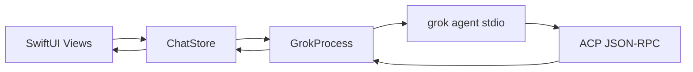

# GrokBuild — architecture reference

**Read this first in a new chat.** GrokBuild is a menu-bar macOS app that wraps `grok agent stdio` — a SwiftUI shell over the CLI, not a replacement for it. The CLI owns ACP, MCP wiring, skills, permissions, plan mode, subagents, and `AGENTS.md` behavior.

---

## Design rules (for agents)

1. **Stay thin** — add UI and local state only; do not reimplement CLI features in Swift unless the UI needs a wrapper.
2. **Reuse services** — `GrokProcess`, `GrokCLIService`, `ChatStore`, `WorkspaceStore`, `SessionLayoutStore`, feature services below.
3. **SwiftPM only** — no Xcode project; build with `make` / `swift build`.
4. **Minimize diff scope** — match existing patterns in the file you touch.
5. **Commit only when asked** — user rule in this repo.

---

## Entry & shell

| Piece | Role |
|-------|------|
| `GrokBuild/main.swift` | AppKit entry (`NSApplicationMain`) |
| `GrokBuild/AppDelegate.swift` | Menu bar, window lifecycle, notification wiring |
| `GrokBuild/StatusBarController.swift` | Status item, auth indicator, menu actions |
| `GrokBuild/ContentView.swift` | Root SwiftUI: sidebar + chat + settings; owns **multi-session** orchestration |
| `GrokBuild/GrokBuildApp.swift` | **Excluded** from build — legacy; do not use `@main` here |

Platform: **macOS 26+**. Version: `VERSION` + `BUILD_NUMBER` → `AppVersion.display`.

---

## Runtime data flow



1. User sends from `ChatView` → `ChatStore.send`.
2. `ChatStore` drives `GrokProcess` (prompt, cancel, mode/model changes).
3. `GrokProcess` spawns `grok` with launch flags + **injected MCP servers** (browser / computer use when enabled).
4. ACP events stream back → `ChatStore` updates `@Observable` state → views re-render.
5. Auth/process changes post `.grokStatusChanged` for menu bar.

**CLI discovery:** `GROK_CLI_PATH` → `~/.grok/bin/grok` → Homebrew → `PATH` (shared by `GrokProcess` and `GrokCLIService`).

---

## Multi-session model (`ContentView`)

GrokBuild keeps **multiple chat tabs** (one `ChatStore` + one `GrokProcess` each), capped by LRU:

| Concept | Implementation |
|---------|----------------|
| Live session | `ContentView.LiveSession` — `UUID`, `ChatStore`, `Workspace`, optional `grokSessionID` |
| LRU cap | `maxConnectedSessions = 4` — idle processes torn down, resumed on reopen |
| Active UI | `selectedSessionID` / `selectedWorkspaceID` |
| Placeholder | `placeholderStore` when no session selected |
| Sidebar rows | Built from `liveSessions` + `SessionLayoutStore` order/hidden/expanded state |

**Project switch:** selecting a workspace creates or resumes a live session, loads **per-project model + effort** from `SessionLayoutStore`, syncs sibling sessions in the same project via `.workspaceAgentSettingsChanged`.

---

## Persistence (UserDefaults)

All local state lives in `~/Library/Preferences/com.grokbuild.app.plist` unless noted.

| Key / store | Owner | Contents |
|-------------|-------|----------|
| `GrokBuild.projects.v1` | `WorkspaceStore` | Project list (folder paths) |
| `GrokBuild.sessionLayout.v2` | `SessionLayoutStore` | Session records, sidebar order, selected session, expanded/hidden groups |
| `GrokBuild.workspaceLayout.v1` | `SessionLayoutStore` | Pin order, workspace order, **`agentSettingsByWorkspace`** (model + reasoning effort per project) |
| `grokbuild.sessionSelections.v1` | `ChatStore` | Per **grok session id**: mode (model is project-level now) |
| `grokbuild.computerUse.*` / `applied.*` | `ComputerUseSettingsStore` | Computer Use draft + applied settings |
| `grokbuild.browser.*` / `applied.*` | `BrowserSettingsStore` | Browser tools draft + applied settings |
| Custom model providers | `CustomModelStore` | Provider definitions; models written to **`~/.grok/config.toml`** |

**Draft vs applied:** Settings panes edit draft keys; **chat status pills and Grok MCP injection use applied** (`loadApplied()` in `ChatStore.restartProcess`). Browser/Computer Use **Enable** toggles apply immediately; other fields use **Apply and Restart Grok**.

Do **not** commit exported plist files from the repo root (see `.gitignore`).

---

## Source map — where to edit what

### UI

| Path | Responsibility |
|------|----------------|
| `Views/SidebarView.swift` | Project list, session list, pins, settings button |
| `Views/ChatView.swift` | Composer, messages area, model/effort popover, browser/computer status pills |
| `Views/GrokChatChrome.swift` | Shared chrome (session gear, effort UI fragments) |
| `Views/RichMessageView.swift`, `MessageBubble.swift` | Markdown, thinking, tool cards, permissions |
| `Views/SettingsView.swift` | All settings tabs (large file — search `SettingsTab`) |
| `Views/PreviewPane.swift` | Diff review / commit / PR |
| `Views/SessionBrowserView.swift`, `SessionsBrowserPanel.swift` | Resume past Grok sessions |
| `AboutPanel.swift`, `UpdatePanel.swift`, `AboutStyle.swift` | AppKit panels (shared metrics) |

### Core services

| Path | Responsibility |
|------|----------------|
| `Services/GrokProcess.swift` | Spawn CLI, ACP protocol, session/new & load, MCP list in launch options |
| `Services/GrokCLIService.swift` | One-shot CLI (`grok models`, hooks inspect, version), `ReasoningEffortLevel` |
| `Services/ChatStore.swift` | Messages, streaming, model/mode/effort, permissions, restart/resume |
| `Services/WorkspaceStore.swift` | Add/remove/reorder/pin projects |
| `Services/SessionLayoutStore.swift` | Session sidebar layout + per-workspace agent settings |
| `Services/GitService.swift` | Branch/worktree helpers for status row |
| `Services/UpdateChecker.swift` | App GitHub release + `grok update --check --json` |
| `Services/MCPServerConfig.swift` | MCP server JSON shape for ACP `session/new` |

### Feature subsystems

| Feature | Services | Settings tab | MCP name | Bundled skill |
|---------|----------|--------------|----------|---------------|
| **Browser control** | `AgentBrowserService`, `BrowserSettingsStore`, `BrowserSkillInstaller` | `.browser` | `grokbuild-browser` | `Resources/Skills/grokbuild-browser-control/` |
| **Computer Use** | `ComputerUseService`, `ComputerUseSettingsStore`, `ComputerUseSkillInstaller`, `ComputerUseCursorInstaller` | `.computerUse` | `grokbuild-computer-use` | `Resources/Skills/grokbuild-computer-use/` |
| **Custom models** | `CustomModelStore`, `CustomModelSettings` | `.models` | — | — |
| **Desktop hints** | — | — | — | `Resources/Skills/grokbuild-desktop/` |

**Browser:** optional `agent-browser` CLI + managed Chromium runtime or external CDP. Tools: `browser_open_url`, `browser_snapshot`, `browser_click_ref`, etc.

**Computer Use:** bundled `agent-desktop` + separate target `GrokBuildComputerUseMCP/` (stdio MCP helper). Tools: `computer_snapshot`, `computer_click`, `computer_type`, `computer_screenshot`, etc. Cursor install copies helper to `~/.grokbuild/computer-use/` and merges `~/.cursor/mcp.json`.

**Models:** OpenAI-compatible providers; reasoning effort via `grok agent --reasoning-effort`; **per-project** model + effort in `SessionLayoutStore`.

---

## Settings tabs (`SettingsTab`)

| Tab | Purpose |
|-----|---------|
| `.hooks` | Inspect hooks via `grok inspect --json` |
| `.plugins` / `.marketplace` | Grok plugin sources |
| `.skills` | Installed/discovered skills |
| `.mcpServers` | External MCP servers + health |
| `.browser` | Browser tools enable, agent-browser install, runtime mode |
| `.computerUse` | Desktop automation, permissions, Cursor integration |
| `.models` | Custom providers + default model |
| `.permissions` | Session safety (no memory, web search, subagents) |

Changing browser/computer settings that affect the live Grok session → **`ChatStore.reloadConfiguration()`** (restarts process with new MCP env).

---

## Notifications (`ContentView.swift`)

| Name | Typical use |
|------|-------------|
| `.grokStatusChanged` | Menu bar auth/connection status |
| `.showMainWindowRequested` | Raise main window from menu bar |
| `.newSessionRequested` | Menu → new session |
| `.workspaceAgentSettingsChanged` | Sync model/effort across sessions in same project |
| `.liveSessionMessagesChanged` | Sidebar title refresh |

Post `.grokStatusChanged` when auth or process state changes.

---

## Build & test

```bash
make run       # build + launch menu bar app
make test      # swift test (Tests/GrokBuildTests/)
make app       # dist/GrokBuild.app
make install   # copy to /Applications/ (signs if SIGN_IDENTITY in .env)
make open      # restart /Applications/GrokBuild.app
make release   # local GitHub release (see BUILDING.md)
```

- Packaging: `Makefile`, `scripts/build-macos-app.sh`, `scripts/release.sh`
- Signing: `.env.example` → `.env` with `SIGN_IDENTITY`
- Menu bar icon: `GrokBuild/Resources/Assets.xcassets/MenuBarIcon.imageset/`
- Skills copied into app bundle at build (`Package.swift` resources)

---

## Common tasks → files

| Task | Start here |
|------|------------|
| Composer / model pill / effort | `ChatView.swift`, `ChatStore.setModel` / `applyReasoningEffort` |
| Per-project model persistence | `SessionLayoutStore`, `ChatStore.loadWorkspaceAgentSettings` |
| Sidebar sessions / empty project | `ContentView.swift` (`selectProject`, session restore) |
| New Grok session / resume | `ChatStore.startNewSession`, `resumeSession`, `GrokProcess` session/load |
| Inject MCP tools | `ChatStore.restartProcess` → `AgentBrowserService.browserMCPConfig`, `ComputerUseService.computerUseMCPConfig` |
| Browser settings UX | `SettingsView` → `BrowserSettingsPane` |
| Computer Use + Cursor MCP | `ComputerUseService`, `ComputerUseCursorInstaller`, `GrokBuildComputerUseMCP/main.swift` |
| Custom model CRUD | `CustomModelStore`, `SettingsView` models pane |
| Menu bar / auth banner | `StatusBarController`, `AppDelegate`, `ChatStore.authRequiredMessage` |
| App/update version UI | `AppVersion.swift`, `UpdateChecker`, `AboutPanel` |

---

## Tests

`Tests/GrokBuildTests/` — persistence, browser/computer integration, session layout, update parsing. Run: `make test`.

Prefer extending existing test files over new harnesses. Key files: `SessionPersistenceTests.swift`, `ComputerUseIntegrationTests.swift`.

---

## Related docs

| Doc | Use |
|-----|-----|
| `AGENTS.md` | Agent entry point (points here) |
| `README.md` | User-facing features |
| `BUILDING.md` | Signing, notarization, release CI |
| `.cursor/rules/` | SwiftUI, CLI integration, AppKit panels |
| `.cursor/skills/grokbuild-*` | Dev workflow, release, CLI checks |
