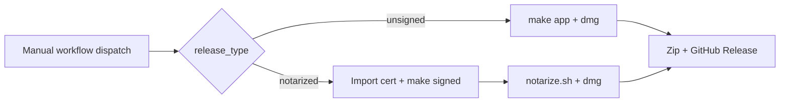

# Building GrokBuild

GrokBuild is built with **Swift Package Manager** (SPM). No Xcode project is required.

For how the app works internally (sessions, MCP, updates, persistence), see [ARCHITECTURE.md](ARCHITECTURE.md).

## To Build & Run (Minimal Setup)

You only need **Xcode Command Line Tools**:

```bash
xcode-select --install
```

This is sufficient for:
- Compiling the app (`swift build`)
- Creating the `.app` bundle and DMG
- Codesigning and notarization

### Quick start

```bash
make build          # or: swift build -c release
make test           # unit tests (Tests/GrokBuildTests/)
make run            # builds + launches .build/GrokBuild.app (release)
make run-debug      # debug build — includes Simulate Updates menu (see below)
```

You can also run the raw binary:

```bash
swift build -c release
./.build/release/GrokBuild
```

`make run` uses `scripts/build-dev-app.sh` for a lightweight `.app` wrapper; `make app` produces a full `dist/GrokBuild.app` for distribution.

## For Development (Recommended)

If you're going to edit the SwiftUI code, install the **full Xcode** IDE from the App Store.

**Why full Xcode is worth it:**
- SwiftUI Previews (live canvas) — the biggest advantage
- Much better debugging tools (view inspector, environment values, etc.)
- Smoother experience when working with complex SwiftUI views

You can still build from the terminal with `make` or `swift build` even with full Xcode installed.

```bash
xed .          # open Package.swift in Xcode
```

Then select the `GrokBuild` scheme.

### Testing update UI locally

Debug builds (`make run-debug`) include a menu-bar **Simulate Updates** submenu (`#if DEBUG` — absent from release/`make run`/`make app` binaries). Use it to exercise the banner and update panel without publishing GitHub releases. Simulated app install relaunches GrokBuild (no binary swap); simulated CLI updates never run `grok update`.

To test real update flows:
- **CLI:** `grok update --version <older>` then **Check for Updates…** → click **Updates Available** on the banner → **Update grok CLI**
- **App:** install an older notarized build from `/Applications`, or temporarily lower `VERSION` before `make app`; the in-app updater only offers **notarized** GitHub releases (see [In-app updates](#in-app-updates) below)

## Packaging

```bash
make app     # creates dist/GrokBuild.app (bundles skills, install helper, agent-desktop)
make dmg     # creates .app + DMG
```

Output:
- `dist/GrokBuild.app`
- `dist/GrokBuild-macOS.dmg`

GitHub release assets use versioned names, e.g. `GrokBuild-v0.1.10.app.zip` and `GrokBuild-v0.1.10-macOS.dmg`.

The build script (`scripts/build-macos-app.sh`) also:
- Copies menu bar icon assets into `Contents/Resources/`
- Bundles `Resources/Skills/` into the app
- Copies `scripts/grokbuild-install-update.sh` → `Contents/Resources/grokbuild-install-update` (in-app upgrade helper)
- Bundles `agent-desktop` into `Contents/MacOS/` when present on the build machine (CI installs it via npm)

## Scripts

| Script | Purpose |
|--------|---------|
| `scripts/build-macos-app.sh` | Assemble `dist/GrokBuild.app`, optional `--sign` |
| `scripts/build-dev-app.sh` | Lightweight `.build/GrokBuild.app` for `make run` |
| `scripts/notarize.sh` | Submit signed app to Apple notary service + staple |
| `scripts/release.sh` | Local GitHub release publish (`make release`) |
| `scripts/grokbuild-install-update.sh` | Used by the app at **Install and Restart** — wait for PID, `ditto` replace bundle, relaunch |

See also [scripts/README.md](scripts/README.md).

## Codesigning / Distribution

### Local config (`.env`)

Store signing credentials locally so you don't pass them on every command:

```bash
cp .env.example .env
# edit .env with your SIGN_IDENTITY and NOTARY_PROFILE
```

`.env` is gitignored. The Makefile loads it automatically (`-include .env`).

Then you can run:

```bash
make signed
make notarize
make dmg                    # notarizes when NOTARY_PROFILE is set in .env
make release RELEASE_TYPE=notarized
```

Command-line values still override `.env` (e.g. `make signed SIGN_IDENTITY="..."`).

To produce a properly signed build:

```bash
make signed SIGN_IDENTITY="Developer ID Application: Your Name (TEAMID)"
```

Or run the script directly:

```bash
./scripts/build-macos-app.sh --sign "Developer ID Application: Your Name (TEAMID)"
```

### What the signing step does
- Builds with `swift build -c release`
- Assembles a proper `.app` bundle structure
- Runs `codesign --force --deep --options runtime`

### Notes on entitlements
The current bundle uses a minimal entitlement for unsigned executable memory (needed by some Swift runtime features). For full notarization you may want to review and expand the entitlements.

## Notarization

To allow users to run the app on modern macOS without Gatekeeper blocking it, notarize the signed app.

### One-liner from Makefile

```bash
make notarize NOTARY_PROFILE=AC_PASSWORD
```

Or let `make dmg` handle it automatically:

```bash
make dmg NOTARY_PROFILE=AC_PASSWORD SIGN_IDENTITY="Developer ID Application: ..."
```

When `NOTARY_PROFILE` is set, `make dmg` will automatically:
- Build + sign the app (if `SIGN_IDENTITY` provided)
- Run notarization (staple the app)
- Rebuild the DMG containing the final stapled app

You only need to set `NOTARY_PROFILE` once per shell or in your environment.

### Manual / Script

You can also run directly:

```bash
./scripts/notarize.sh dist/GrokBuild.app
```

With custom profile:

```bash
NOTARY_PROFILE=myprofile ./scripts/notarize.sh dist/GrokBuild.app
```

Create the keychain profile once:

```bash
xcrun notarytool store-credentials "APPLE_CONNECT_PASSWORD" \
  --apple-id your@email.com --team-id YOURTEAMID
```

## In-app updates

GrokBuild ships a custom updater (not Sparkle). Two paths:

| Target | Mechanism |
|--------|-----------|
| **GrokBuild app** | Download `GrokBuild-{tag}.app.zip` from GitHub, verify codesign + Gatekeeper, replace bundle via `grokbuild-install-update` |
| **grok CLI** | Run `grok update` after shutting down live sessions |

### Notarized releases only (app)

`UpdateChecker` scans GitHub releases and picks the newest release marked **notarized**:
- Release **title** contains `(Notarized)`, e.g. `v0.1.10 (Notarized)`
- Or release **notes** contain `properly code-signed and notarized`

**Unsigned releases are never offered** in-app, even if they are the newest tag. Publish notarized builds for users who rely on one-click upgrades.

Implementation: `GrokBuild/Services/UpdateChecker.swift`, `AppUpdater.swift`, `GrokCLIUpdater.swift`, `UpdatePanel.swift`. Full flow: [ARCHITECTURE.md — In-app updates](ARCHITECTURE.md#in-app-updates).

### Install helper

At **Install and Restart**, `AppUpdater` execs the bundled bash script:

```
Contents/Resources/grokbuild-install-update
```

Source: `scripts/grokbuild-install-update.sh` (copied during `make app`). It waits for the running app PID, replaces the bundle with `ditto`, and reopens the app.

In-app install requires:
- A writable install location (typically `/Applications`)
- Downloaded zip passing signature verification
- Matching Team ID when the installed app is signed

## GitHub Releases

There are two ways to publish a release: **GitHub Actions** (recommended) or **local `make release`**. Use one path per version — not both at once.

Release title format (both paths):
- `v{VERSION} (Notarized)` — signed + notarized; **required for in-app app updates**
- `v{VERSION} (Unsigned)` — development builds; Gatekeeper workarounds in release notes

### CI (recommended)

Workflow: `.github/workflows/release.yml`

**Trigger:** **Actions → Release → Run workflow** (manual dispatch only). Tag push auto-release is currently disabled in the workflow file.

Inputs:
- `release_type`: `notarized` (default) or `unsigned`
- `version`: optional tag override; must match `VERSION` (e.g. `v0.1.11`)

Steps before dispatch:
1. Bump `VERSION`.
2. Commit and push to the branch you are releasing from.



#### Notarized CI release (default)

Requires repo secrets:

| Secret | Purpose |
|--------|---------|
| `MACOS_CERTIFICATE` | Base64-encoded `.p12` Developer ID cert |
| `MACOS_CERTIFICATE_PWD` | Password for the `.p12` |
| `SIGN_IDENTITY` | Codesign identity (defaults to `Developer ID Application`) |
| `APPLE_API_KEY_ID` | App Store Connect API key ID |
| `APPLE_API_ISSUER_ID` | App Store Connect issuer ID |
| `APPLE_API_KEY_BASE64` | Base64-encoded `.p8` API key |

CI installs `agent-desktop` globally (`npm install -g agent-desktop`) before building so it can be bundled into the app.

#### Unsigned CI release

Select `release_type: unsigned` in the workflow dispatch. No signing secrets required. Release notes include Gatekeeper bypass instructions.

**Notarization on CI:** `notarize.sh` supports Apple API keys (`APPLE_API_KEY_*`) for headless runners. Keychain profiles (`NOTARY_PROFILE`) work locally but not on ephemeral CI machines.

**Local vs CI credentials:**

| | Local (`.env` / keychain) | CI (GitHub secrets) |
|--|---------------------------|---------------------|
| Signing | `SIGN_IDENTITY` in Keychain | `MACOS_CERTIFICATE` p12 imported per job |
| Notarization | `NOTARY_PROFILE` (keychain) | Apple API key env vars |

The workflow creates/updates the GitHub release for tag `v{VERSION}` with versioned `.app.zip` and `.dmg` assets plus generated changelog notes.

### Local (`make release`)

For publishing entirely from your Mac (requires [GitHub CLI](https://cli.github.com/) authenticated with `gh auth login`):

```bash
# 1. Bump VERSION, commit
# 2. Publish unsigned release (default)
make release
```

`make release` runs `scripts/release.sh`: builds, zips, creates/updates the GitHub release, and pushes tag `v{VERSION}` if needed.

**Notarized local release** (with `.env` configured):

```bash
make release RELEASE_TYPE=notarized
```

Or inline:

```bash
make release RELEASE_TYPE=notarized \
  SIGN_IDENTITY="Developer ID Application: Your Name (TEAMID)" \
  NOTARY_PROFILE=AC_PASSWORD
```

**Options:**

| Variable | Default | Description |
|----------|---------|-------------|
| `RELEASE_TYPE` | `unsigned` | `unsigned` or `notarized` |
| `RELEASE_VERSION` | from `VERSION` | Tag override (must match `VERSION`, e.g. `v0.1.4`) |
| `SIGN_IDENTITY` | — | Required for `RELEASE_TYPE=notarized` (or set in `.env`) |
| `NOTARY_PROFILE` | `AC_PASSWORD` | Keychain profile for notarization (or set in `.env`) |

The tag is derived from `VERSION` (e.g. `0.1.4` → `v0.1.4`). If a release for that tag already exists, assets and notes are updated in place.

## SPM targets

| Target | Output |
|--------|--------|
| `GrokBuild` | Main menu-bar app |
| `GrokBuildComputerUseMCP` | Stdio MCP bridge → `agent-desktop` (bundled/copied at app build) |
| `GrokBuildTests` | Unit tests |

Platform: macOS 26+ (`Package.swift`).

## Icon

The menu bar icon lives in the asset catalog:

- `GrokBuild/Resources/Assets.xcassets/MenuBarIcon.imageset/MenuBarIcon.png`
- `GrokBuild/Resources/Assets.xcassets/MenuBarIcon.imageset/MenuBarIcon@2x.png` (recommended)
- `...@3x.png` (also supported)

The build script copies these into `Contents/Resources/`. No need to duplicate PNGs at the project root.

## Related docs

| Doc | Use |
|-----|-----|
| [ARCHITECTURE.md](ARCHITECTURE.md) | App architecture, persistence, updates, task → file map |
| [AGENTS.md](AGENTS.md) | Agent entry point |
| [README.md](README.md) | User-facing feature list |
| [scripts/README.md](scripts/README.md) | Build script overview |
