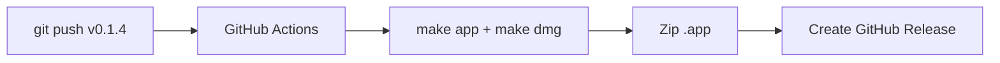
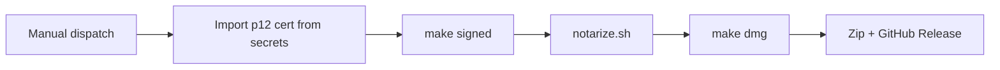

# Building GrokBuild

GrokBuild is built with **Swift Package Manager** (SPM). No Xcode project is required.

## To Build & Run (Minimal Setup)

You only need **Xcode Command Line Tools**:

```bash
xcode-select --install
```

This is sufficient for:
- Compiling the app (`swift build`)
- Creating the `.app` bundle and DMG
- Codesigning and notarization

### Quick start

```bash
make build          # or: swift build -c release
make run            # builds + launches the menu bar app
```

You can also run directly:

```bash
swift build -c release
./.build/release/GrokBuild
```

## For Development (Recommended)

If you're going to edit the SwiftUI code, install the **full Xcode** IDE from the App Store.

**Why full Xcode is worth it:**
- SwiftUI Previews (live canvas) — the biggest advantage
- Much better debugging tools (view inspector, environment values, etc.)
- Smoother experience when working with complex SwiftUI views

You can still build from the terminal with `make` or `swift build` even with full Xcode installed.

```bash
xed .          # open Package.swift in Xcode
```

Then select the `GrokBuild` scheme.

## Packaging

```bash
make app     # creates a distributable .app bundle (includes MenuBarIcon)
make dmg     # creates .app + DMG
```

Output goes to `dist/GrokBuild.app` and `dist/GrokBuild-macOS.dmg`.

The build script automatically copies the menu bar icon (from the asset catalog under `GrokBuild/Resources/...` or project root) into `Contents/Resources/`.

## Codesigning / Distribution

### Local config (`.env`)

Store signing credentials locally so you don't pass them on every command:

```bash
cp .env.example .env
# edit .env with your SIGN_IDENTITY and NOTARY_PROFILE
```

`.env` is gitignored. The Makefile loads it automatically (`-include .env`).

Then you can run:

```bash
make signed
make notarize
make dmg                    # notarizes when NOTARY_PROFILE is set in .env
make release RELEASE_TYPE=notarized
```

Command-line values still override `.env` (e.g. `make signed SIGN_IDENTITY="..."`).

To produce a properly signed build:

```bash
make signed SIGN_IDENTITY="Developer ID Application: Your Name (TEAMID)"
```

Or run the script directly:

```bash
./scripts/build-macos-app.sh --sign "Developer ID Application: Your Name (TEAMID)"
```

### What the signing step does
- Builds with `swift build -c release`
- Assembles a proper `.app` bundle structure
- Runs `codesign --force --deep --options runtime`

### Notes on entitlements
The current bundle uses a minimal entitlement for unsigned executable memory (needed by some Swift runtime features). For full notarization you may want to review and expand the entitlements.

## Notarization

To allow users to run the app on modern macOS without Gatekeeper blocking it, notarize the signed app.

### One-liner from Makefile

```bash
make notarize NOTARY_PROFILE=AC_PASSWORD
```

Or let `make dmg` handle it automatically:

```bash
make dmg NOTARY_PROFILE=AC_PASSWORD SIGN_IDENTITY="Developer ID Application: ..."
```

When `NOTARY_PROFILE` is set, `make dmg` will automatically:
- Build + sign the app (if `SIGN_IDENTITY` provided)
- Run notarization (staple the app)
- Rebuild the DMG containing the final stapled app

You only need to set `NOTARY_PROFILE` once per shell or in your environment.

### Manual / Script

You can also run directly:

```bash
./scripts/notarize.sh
```

With custom profile:

```bash
NOTARY_PROFILE=myprofile ./scripts/notarize.sh
```

Create the keychain profile once:

```bash
xcrun notarytool store-credentials "APPLE_CONNECT_PASSWORD" \
  --apple-id your@email.com --team-id YOURTEAMID
```

## GitHub Releases

There are two ways to publish a release. Use one path per version — not both.

### CI (recommended)

See `.github/workflows/release.yml`:

1. Bump `VERSION` (and `BUILD_NUMBER` if needed), commit, and push.
2. Create and push a matching tag:

```bash
git tag v0.1.4
git push origin v0.1.4
```

- **Tag push** (`v*`): publishes an **unsigned** release with `GrokBuild.app.zip` and `GrokBuild-macOS.dmg`.
- **Manual workflow dispatch** (choose `notarized`): builds a signed + notarized release using repo secrets.

#### CI: unsigned (tag push)



No signing. Same output as `make release` locally (unsigned default).

#### CI: signed + notarized (manual dispatch only)

Triggered from **Actions → Release → Run workflow** with `release_type: notarized`. **Not** triggered by tag push.



**Repo secrets used:**

| Secret | Purpose |
|--------|---------|
| `MACOS_CERTIFICATE` | Base64-encoded `.p12` Developer ID cert |
| `MACOS_CERTIFICATE_PWD` | Password for the `.p12` |
| `SIGN_IDENTITY` | Codesign identity (defaults to `Developer ID Application`) |

**Notarization on CI:** `notarize.sh` supports Apple API keys (`APPLE_API_KEY_PATH`, `APPLE_API_KEY_ID`, `APPLE_API_ISSUER_ID`) for headless runners. Keychain profiles (`NOTARY_PROFILE`) work locally but not on ephemeral CI machines — wire API key secrets into the workflow if you use notarized CI releases.

**Local vs CI credentials:**

| | Local (`.env` / keychain) | CI (GitHub secrets) |
|--|---------------------------|---------------------|
| Signing | `SIGN_IDENTITY` in Keychain | `MACOS_CERTIFICATE` p12 imported per job |
| Notarization | `NOTARY_PROFILE` (keychain) | Apple API key env vars (recommended) |

Release title format: `v{VERSION} ({BUILD_NUMBER}) (Unsigned)` or `(Notarized)`.

The release body includes download links, Gatekeeper notes for unsigned builds, and auto-generated changelog notes from merged PRs/commits.

### Local (`make release`)

For publishing entirely from your Mac (requires [GitHub CLI](https://cli.github.com/) authenticated with `gh auth login`):

```bash
# 1. Bump VERSION, commit
# 2. Publish unsigned release (default)
make release
```

`make release` is **local only**. It mirrors the CI release workflow: same naming, notes, and assets. By default it produces an **unsigned** build — same as pushing a `v*` tag.

**Notarized local release** (with `.env` configured):

```bash
make release RELEASE_TYPE=notarized
```

Or inline:

```bash
make release RELEASE_TYPE=notarized \
  SIGN_IDENTITY="Developer ID Application: Your Name (TEAMID)" \
  NOTARY_PROFILE=AC_PASSWORD
```

**Options:**

| Variable | Default | Description |
|----------|---------|-------------|
| `RELEASE_TYPE` | `unsigned` | `unsigned` or `notarized` |
| `RELEASE_VERSION` | from `VERSION` | Tag override (must match `VERSION`, e.g. `v0.1.4`) |
| `SIGN_IDENTITY` | — | Required for `RELEASE_TYPE=notarized` (or set in `.env`) |
| `NOTARY_PROFILE` | `AC_PASSWORD` | Keychain profile for notarization (or set in `.env`) |

The tag is derived from `VERSION` (e.g. `0.1.4` → `v0.1.4`). If a release for that tag already exists, assets and notes are updated in place.

Implementation: `scripts/release.sh` (invoked by the Makefile `release` target).

## Icon

The menu bar icon lives in the asset catalog:

- `GrokBuild/Resources/Assets.xcassets/MenuBarIcon.imageset/MenuBarIcon.png`
- `GrokBuild/Resources/Assets.xcassets/MenuBarIcon.imageset/MenuBarIcon@2x.png` (recommended)
- `...@3x.png` (also supported)

The build script automatically finds the icon from the asset catalog (or as a fallback from the project root) and copies the PNGs into `Contents/Resources/`. 

No need to place duplicate files at the project root — the files already in the imageset are used.
