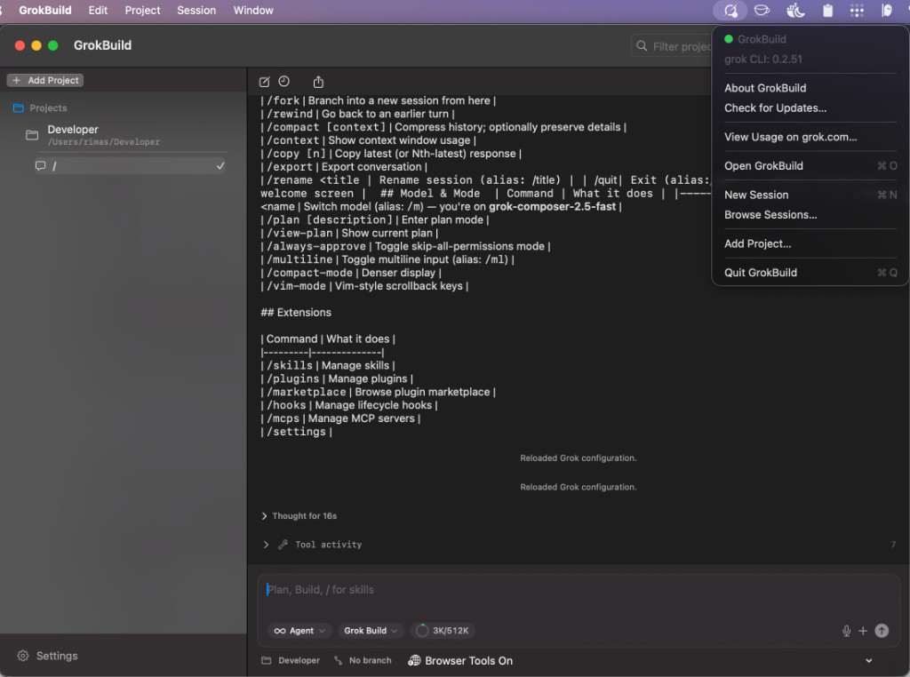

# GrokBuild Desktop App

GrokBuild Desktop is a native SwiftUI macOS app for using the [`grok`](https://grok.com) CLI as a desktop AI development environment.

It gives Grok a project-focused chat UI with persistent workspaces, resumable sessions, rich message rendering, diff review, full settings for Grok CLI features, optional browser-control tools, and optional macOS desktop automation. The app stays close to the CLI: GrokBuild launches and talks to `grok agent stdio`, while the CLI remains responsible for core capabilities such as ACP, MCP, skills, subagents, `AGENTS.md` instructions, permissions, and plan mode.



## Features

### Chat & sessions
- Native macOS SwiftUI interface for `grok agent stdio`.
- Streaming chat with Markdown rendering, thinking blocks, live tool activity, permission prompts, and question cards.
- Resumable sessions with a session browser for reopening existing Grok sessions in the current project.
- Diff review of file changes proposed during a session.
- Multi-tab sessions with lazy restore and an LRU cap on live Grok processes (see [ARCHITECTURE.md](ARCHITECTURE.md)).

### Projects & workspaces
- Persistent project sidebar with pinned projects, per-project session lists, session rename/close, and recent-session collapsing.
- Per-project **model** and **reasoning effort** — restored when you switch projects.
- Git branch and worktree management from the chat status row.
- `Open in` menu for Finder, Cursor, VS Code, Terminal, iTerm, and Zed.

### Composer
- Fixed two-line composer with command history and slash-command autocomplete.
- File attachments and voice input (dictation).
- Model, mode, and context-usage controls inline in the composer.

### Models
- Add custom OpenAI-compatible models from your own providers (e.g. MiniMax and other OpenAI-compatible endpoints).
- Define reusable providers (base URL + shared API key) and fetch their available models directly in the app.
- Models are written to `~/.grok/config.toml` and become usable via `/model <id>`; supports setting a default model (up to 28 custom models).
- **Reasoning effort** for reasoning-capable models — pick effort (Minimal through Max) from the same composer model menu; each project remembers its own model and effort and restores them when you switch workspaces.

### Browser control
Let Grok drive a **Chromium browser** for web tasks (navigate, read pages, click, type, wait, screenshot, run JS) via `browser_*` MCP tools backed by [`agent-browser`](https://agent-browser.dev).
- **Managed runtime (default)** — GrokBuild installs and uses a separate automation Chrome/Chromium profile (`agent-browser install`); no CDP URL required.
- **Existing browser** — attach to Chrome, Brave, Edge, Arc, or another Chromium browser over CDP when you want Grok to use your own window.
- Enable in **Settings → Browser**, then **Apply and Restart Grok**; toggle quickly from the chat status bar (**Browser Tools On/Off**).
- Installs a `grokbuild-browser-control` skill into your Grok skills folder so the agent knows the workflow (snapshot → ref-based click/type).

### Computer Use (desktop automation)
Let Grok control **native macOS UI** — apps, menus, dialogs, Finder, Safari, and system windows — via `computer_*` MCP tools backed by [`agent-desktop`](https://github.com/lahfir/agent-desktop).
- Tools include accessibility snapshots, ref-based click/type, keyboard shortcuts, waits, optional screenshots, and listing apps/windows.
- `agent-desktop` is **bundled in GrokBuild** and reuses the app's Accessibility permission (grant once in **Settings → Computer Use**).
- Enable in settings or from the chat status bar (**Computer Use On/Off**); optional **Allow screenshot tool** (needs Screen Recording).
- Safety controls: action policy (Auto / Ask / Deny), step and timeout limits, accessibility-first automation (physical mouse off by default).
- Installs a `grokbuild-computer-use` skill; use Computer Use for macOS apps, Browser control for websites in Chromium.
- Optional **Cursor integration** — **Install for Cursor** copies the MCP helper to `~/.grokbuild/computer-use/` and registers `grokbuild-computer-use` in `~/.cursor/mcp.json` so Cursor Agent gets the same tools globally.

### Grok CLI integration
- **Hooks** — inspect automation hooks discovered from Grok, Cursor, Claude, project, and plugin sources.
- **Plugins** — manage installed Grok plugins and add trusted plugin sources.
- **Marketplace** — browse available plugins and manage marketplace sources.
- **Skills** — view user, project, compatibility, and plugin skills available to Grok.
- **MCP servers** — configure external Model Context Protocol servers and run health checks.
- **Permissions** — session safety toggles (disable memory, web search, or subagents for new sessions).

### App experience
- Menu bar item plus main window (Dock icon); single-instance app with status bar quick actions.
- Built-in update checks for **GrokBuild** and the **`grok` CLI** (background on launch + daily; manual via **Check for Updates…**).
- **In-app GrokBuild updates** — for signed + **notarized** releases only: background check shows a main-window banner; click **Updates Available** to open the panel, download `GrokBuild-{tag}.app.zip`, verify signature, **Install and Restart** (via bundled install helper).
- **In-app grok CLI updates** — banner → updates panel → **Update grok CLI** runs `grok update`; live sessions stop during the upgrade and can be restarted afterward.
- **Settings → App** — installed versions, auto-check toggle, pending update status.
- Login-state detection with a helpful `grok login` banner.
- Dark-mode-first visual design.

## Install

Download a release from the [GitHub Releases page](https://github.com/rimusz/grok-build-desktop/releases), then move `GrokBuild.app` to `/Applications` (or run it from the extracted folder).

**Recommended:** choose a release titled **`(Notarized)`** — no Gatekeeper warnings, and the in-app updater only offers **notarized** builds (unsigned releases on GitHub are ignored by the updater even if they are newer).

Release assets are versioned, e.g. `GrokBuild-v0.1.10.app.zip` and `GrokBuild-v0.1.10-macOS.dmg`.

### Requirements
- macOS 26 (Tahoe) or later
- The `grok` CLI installed (usually at `~/.grok/bin/grok`)
- Logged in to the CLI — run `grok login` in your terminal

### Opening unsigned builds

Some releases are published as **`(Unsigned)`** for development. macOS Gatekeeper may block them the first time you open:

1. **Right-click** `GrokBuild.app` → **Open**, then confirm **Open** (bypasses the block once).
2. Open **System Settings → Privacy & Security** and click **Open Anyway** next to the blocked-app message.
3. Remove the quarantine attribute:
   ```bash
   xattr -cr /Applications/GrokBuild.app
   ```

Unsigned builds do not receive in-app GrokBuild upgrade offers. Use a notarized release for one-click updates, or build from source.

## Building from source

### Minimal setup

You only need **Xcode Command Line Tools**:

```bash
xcode-select --install
```

That is enough to compile the app, create the `.app` bundle and DMG, and codesign/notarize.

```bash
make build          # build the release binary
make test           # run unit tests
make run            # build release + launch from .build/GrokBuild.app
make run-debug      # build debug + launch — includes menu **Simulate Updates**
make app            # create dist/GrokBuild.app
make dmg            # create the .app + DMG
```

See [BUILDING.md](BUILDING.md) for packaging, signing, notarization, and GitHub releases.

### Recommended for SwiftUI work

If you plan to edit the SwiftUI code, install the **full Xcode** IDE from the App Store for:

- SwiftUI Previews (live canvas) — the biggest advantage
- Better debugging tools (view hierarchy, environment inspection)
- A smoother experience with complex SwiftUI views

You can still build from the terminal with `make` or `swift build` with full Xcode installed:

```bash
xed .          # open Package.swift in Xcode
```

### Signing & notarization

```bash
cp .env.example .env   # optional: SIGN_IDENTITY, NOTARY_PROFILE
make signed SIGN_IDENTITY="Developer ID Application: Your Name (TEAMID)"
make notarize NOTARY_PROFILE=AC_PASSWORD
make release RELEASE_TYPE=notarized
```

Signing requires a **Developer ID Application** certificate, and notarization requires App Store Connect access. Full details: [BUILDING.md](BUILDING.md).

### Developer documentation

| Doc | Purpose |
|-----|---------|
| [ARCHITECTURE.md](ARCHITECTURE.md) | **Start here** — app structure, data flow, persistence, updates, common tasks → files |
| [AGENTS.md](AGENTS.md) | Agent/copilot entry point |
| [BUILDING.md](BUILDING.md) | Build, sign, notarize, release CI |

Debug builds (`make run-debug`) include a menu-bar **Simulate Updates** submenu for testing the update UI without publishing releases. It is compiled out of release builds (`make run`, `make app`, GitHub releases).

### Notes

- Version strings come from `VERSION` → `AppVersion.display`.
- The menu bar icon lives in `GrokBuild/Resources/Assets.xcassets/MenuBarIcon.imageset/` and is copied into the app bundle during the build.
- Bundled grok skills and the in-app install helper are copied into the `.app` at package time (`scripts/build-macos-app.sh`).
