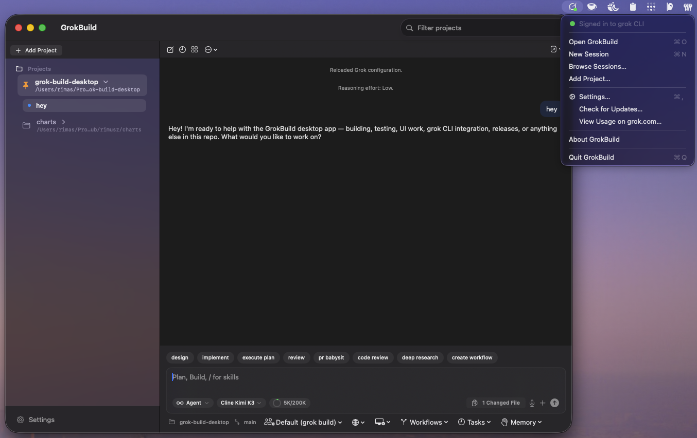

# GrokBuild Desktop App

GrokBuild Desktop App is a native SwiftUI macOS shell for the [`grok`](https://grok.com) CLI — a project-focused agent UI with persistent workspaces, resumable sessions, and settings for CLI features.

You can also install GrokBuild just to manage custom OpenAI-compatible models in **Settings → Models** (writes `~/.grok/config.toml`; no project or session needed), then use them in the grok TUI.



## Requirements

- macOS 26 (Tahoe) or later
- The `grok` CLI installed, usually at `~/.grok/bin/grok`
- A logged-in CLI session — run `grok login` in Terminal before starting your first session (not needed if you only manage custom models)

## Quick Start

### Start with a project

1. Install and sign in to the `grok` CLI (`grok login`).
2. Download a notarized release from [GitHub Releases](https://github.com/rimusz/grok-build-desktop/releases) and move `GrokBuild.app` to `/Applications`.
3. Open GrokBuild Desktop App and choose **Add Project**.
4. Pick a folder. It can be a code repo, a docs folder, or a scratch workspace.
5. Start a session. GrokBuild Desktop App launches `grok agent stdio` for that project and streams it in the app.

### Custom models only

If you mainly use the grok TUI or CLI and just need a UI for providers and models:

1. Install the `grok` CLI and open GrokBuild Desktop App (no project or `grok login` required for this path).
2. Open **Settings → Models**.
3. Install a provider (endpoint + API key), then add one or more OpenAI-compatible models.
4. Entries are written to `~/.grok/config.toml` and work with the grok CLI/TUI via `/model <id>` — and in GrokBuild sessions if you use them later.

## What GrokBuild Desktop App Is

GrokBuild Desktop App owns the macOS window, project sidebar, session tabs, settings UI, browser/computer-use enablement, and local app update flow. A common lightweight use is **Settings → Models** alone: manage custom providers and models for the shared `~/.grok/config.toml` without opening a project or starting a session.

It is **not** a replacement for the CLI. The `grok` CLI still owns agent reasoning, ACP, MCP tools, models, skills, subagents, plan mode, permissions, memory, hooks, plugins, and `AGENTS.md` instructions.

## Install

Download a notarized release from the [GitHub Releases page](https://github.com/rimusz/grok-build-desktop/releases), then move `GrokBuild.app` to `/Applications` (or run it from the extracted folder). Releases are signed and notarized — no Gatekeeper workarounds needed.

Release assets are versioned, e.g. `GrokBuild-v0.1.10.app.zip` and `GrokBuild-v0.1.10-macOS.dmg`.

## Feature Highlights

### Sessions

- Streaming agent sessions for `grok agent stdio` with Markdown, thinking blocks, live tool cards, permission prompts, plan/question cards, and diff review.
- Multi-tab sessions with lazy restore, resumable grok sessions, a session browser, and transcript recovery from grok's on-disk `chat_history.jsonl` when possible.
- **Session status badges** on the sidebar — working, needs-input, finished-unread, or error — cleared when you focus the session, so parallel tabs show which one needs you.
- **Session context menu** — pin a session to the top of its project group, mark unread/read, duplicate, clear the transcript, or close. Right-click a message to **Rewind to Here** (chat-only truncate; does not restore files).
- **Steer mid-turn** — send a prompt while grok is working to inject it into the running turn instead of queueing (grok never cancels the turn). Turn it on for every send with **Settings → App → Steer by default**, or pick **Steer into current turn** from the queue menu.
- **Sound on finish** — optionally chime when a turn ends and GrokBuild is not focused (**Settings → App**).
- **Privacy Mode** — redact project paths, project names, and session titles in the UI for screenshots (**Settings → App**). Stored data is unchanged.
- Composer controls for model, mode, context usage, voice dictation, file attachments, slash-command autocomplete, **skill chips** (`/design`, `/review`, …), **research/workflow chips** (`/deep-research`, `/create-workflow`), **imagine chips**, `/goal` with optional budget, prompt queue while streaming, and session dashboard.
- Guided empty state with quick-start prompts; use **Clear** on an Empty session to remove it from the tab strip.

### Project Workflow

- Persistent project sidebar with pinned projects, pinned sessions, recent sessions, session rename/close, and one-click **Add Project** onboarding.
- Per-tab **model** selection and per-project **reasoning effort**.
- Git branch/worktree management from the session status row; **New Worktree Session…** from the project menu, with a **WT** badge on linked worktree projects.
- `Open in` menu for Finder, Cursor, VS Code, Terminal, iTerm, and Zed.
- **Custom models (standalone)** — OpenAI-compatible providers and models in **Settings → Models**, written to `~/.grok/config.toml`. Usable on its own (no project/session); models are then available in the grok CLI/TUI and in GrokBuild sessions. Each model can set an **API backend** (Chat Completions / Responses / Anthropic Messages) and an optional **env key** so the secret stays out of the file.
- **Cursor models via a local bridge** — in **Settings → Models → Add Provider**, install **Cursor**, paste a [Cursor API key](https://cursor.com/dashboard?tab=integrations) (stored locally under Application Support, not in config.toml — models keep a placeholder `api_key`), and save. Save stays disabled without a key; GrokBuild validates the key with Cursor before saving or starting the local OpenAI `/v1` sidecar on port `18787` (bundled Node/`@cursor/sdk`; the sidecar uses that saved key for Cursor, not grok's xAI session token; Cursor IDE need not be open; system Node ≥ 22.13 required — Settings and Doctor suggest Homebrew or nodejs.org if missing). Fetch the catalog, then **Add model** (same as other providers; display names like **Cursor Composer 2.5**). Grok routes inference to the bridge while keeping its own tools. Cursor's subscription/ToS is your responsibility. Unrelated to **Settings → Compatibility → Cursor** (rules/skills) and the Computer Use Cursor MCP.
- **Doctor** — **Settings → App → Open Doctor…** checks the grok CLI path, version, authentication, `config.toml`, Browser/Computer Use readiness, Node.js (≥ 22.13 for the Cursor bridge), and (optionally) whether a local Cursor bridge is reachable, with one-click paths to install the CLI, run `grok login`, or install Node (Homebrew / nodejs.org).

### Agent Capabilities

- **Main agents** — browse agents discovered by `grok inspect --json`, choose the default agent for new sessions, or override the active tab from the agent pill. These choices pass through as `grok --agent` and restart the affected session.
- **Custom subagents (roles)** — create reusable roles with a name, optional model, and instruction. GrokBuild Desktop App writes them to `[subagents.roles.*]` in `~/.grok/config.toml` and stores instructions in `~/.grok/prompts/<name>.md`.
- **Using subagents** — keep the main agent as Default and prompt normally; grok delegates to matching subagents automatically, or you can ask for one by name (for example, *"use the researcher subagent to map the auth flow"*). **Run as custom role** in the agent picker runs the whole session as that role instead of spawning a child subagent. To block spawning child subagents, use **Settings → Permissions**.
- Inspect hooks, plugins, marketplace sources (install/enable/disable), compatibility layers (Cursor/Claude/Codex), skills, MCP servers, and session permissions from Settings.

### Optional Automation

Enable Browser and Computer Use from **Settings → Browser** / **Settings → Computer Use**, then **Apply and Restart**, or use the matching status-bar pills when a session is active.

- **Browser control** — let Grok drive a real Chromium browser via `browser_*` MCP tools backed by [`agent-browser`](https://agent-browser.dev). Use a managed automation profile or attach to Chrome, Brave, Edge, Arc, or another Chromium browser over CDP.
- **Computer Use** — let Grok drive native macOS UI via `computer_*` MCP tools backed by [`agent-desktop`](https://github.com/lahfir/agent-desktop), with action policy, step limits, timeouts, and optional Cursor MCP integration.
- **Memory** — experimental and off by default. Enable from Settings, browse `~/.grok/memory/`, and add "Remember" notes from the session status bar. Slash commands like `/flush` and `/dream` remain TUI-only.
- **Background tasks** — scheduled `/loop` tasks plus background shells, monitors, and subagents mirrored in the Tasks pill. Schedules only fire while GrokBuild Desktop App is open and that session process is alive (inactive tabs may be stopped by LRU eviction).
- **Rhai workflows** — enable in Settings → Workflows (`[workflows] enabled` in config.toml, shared with the grok TUI). The Workflows pill lists runs, saved `.grok/workflows/` scripts, and deep research. This is separate from skill chips in the composer.
- **Session tools** — fork session (new tab with `--fork-session`), share link (`/share` + clipboard), `/btw` aside panel, create-skill sheet, and multi-session dashboard grouped by status.
- **Documents and spreadsheets** — use grok's document skills (`xlsx`, `docx`, `pptx`) to create, read, edit, and reformat Office files from paths in your workspace. Spreadsheet skills may need [LibreOffice](https://www.libreoffice.org/) installed for some conversions.

### App Experience

- Menu bar item plus main window with status-dot icon, quick actions, settings, update checks, and sign-in recovery.
- In-app update panels for both GrokBuild Desktop App and the `grok` CLI. App updates are offered only for signed and notarized releases.
- Dark-mode-first SwiftUI design with accessibility labels for interactive status controls.

## Permissions & Privacy

- Optional **Privacy Mode** (Settings → App) redacts project paths and names in the UI for screen sharing; it does not change stored sessions or CLI data.
- GrokBuild Desktop App talks to the local `grok` CLI; your prompts, tool calls, model routing, auth, and CLI-side storage follow the CLI's behavior.
- Browser control uses a separate managed Chromium profile by default. If you attach to an existing browser over CDP, Grok can interact with that browser window.
- Computer Use requires macOS Accessibility permission. Screenshots require Screen Recording and are optional.
- You can control tool approval behavior in **Settings → Permissions** and **Settings → Computer Use** (Auto / Ask / Deny, plus limits).

## Building from source

### Minimal setup

You only need **Xcode Command Line Tools**:

```bash
xcode-select --install
```

That is enough to compile the app, create the `.app` bundle and DMG, and codesign/notarize.

```bash
make build          # build the release binary
make test           # run unit tests
make run            # build release + launch from .build/GrokBuild.app
make run-debug      # build debug + launch — includes menu **Simulate Updates**
make app            # create dist/GrokBuild.app
make dmg            # create the .app + DMG
```

See [BUILDING.md](BUILDING.md) for packaging, signing, notarization, and GitHub releases.

### Opening a self-built (unsigned) app

Local builds from `make app` / `make run` are unsigned. macOS Gatekeeper may block them the first time you open a copied `.app` (for example after moving `dist/GrokBuild.app` to `/Applications`):

1. **Right-click** `GrokBuild.app` → **Open**, then confirm **Open** (bypasses the block once).
2. Open **System Settings → Privacy & Security** and click **Open Anyway** next to the blocked-app message.
3. Or remove the quarantine attribute:
   ```bash
   xattr -cr /path/to/GrokBuild.app
   ```

Self-built apps do not receive in-app upgrade offers. Use a notarized GitHub release for one-click updates, or keep rebuilding from source.

### Recommended for SwiftUI work

If you plan to edit the SwiftUI code, install the **full Xcode** IDE from the App Store for:

- SwiftUI Previews (live canvas) — the biggest advantage
- Better debugging tools (view hierarchy, environment inspection)
- A smoother experience with complex SwiftUI views

You can still build from the terminal with `make` or `swift build` with full Xcode installed:

```bash
xed .          # open Package.swift in Xcode
```

### Signing & notarization

```bash
cp .env.example .env   # optional: SIGN_IDENTITY, NOTARY_PROFILE
make signed SIGN_IDENTITY="Developer ID Application: Your Name (TEAMID)"
make notarize NOTARY_PROFILE=AC_PASSWORD
make release RELEASE_TYPE=notarized
```

Signing requires a **Developer ID Application** certificate, and notarization requires App Store Connect access. Full details: [BUILDING.md](BUILDING.md).

### Developer documentation

| Doc | Purpose |
|-----|---------|
| [ARCHITECTURE.md](ARCHITECTURE.md) | **Start here** — app structure, data flow, persistence, updates, common tasks → files |
| [AGENTS.md](AGENTS.md) | Agent/copilot entry point |
| [BUILDING.md](BUILDING.md) | Build, sign, notarize, release CI |

Debug builds (`make run-debug`) include a menu-bar **Simulate Updates** submenu for testing the update UI without publishing releases. It is compiled out of release builds (`make run`, `make app`, GitHub releases).

## License

[Apache License 2.0](LICENSE). GrokBuild Desktop App is an independent desktop client for the Grok Build CLI and is not affiliated with, endorsed by, or sponsored by xAI.
